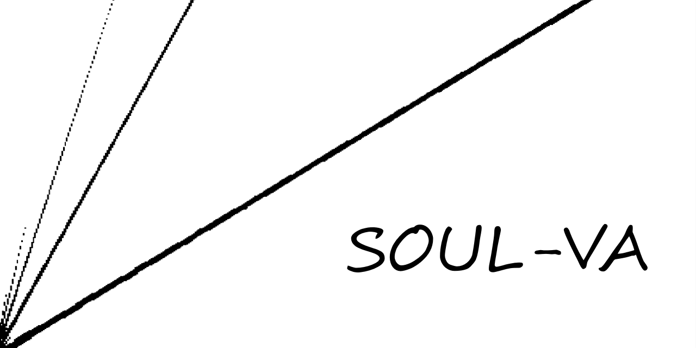

# The SOUL Virtual Analog Library
[SOUL-VA](https://github.com/thezhe/SOUL-VA) is a collection of analog-inspired audio effects. Unlike other libraries, this project achieves [analytical](https://math.stackexchange.com/questions/935405/what-s-the-difference-between-analytical-and-numerical-approaches-to-problems) solutions and [a strict -60dB peak amplitude limit for aliasing artifacts](https://github.com/thezhe/SOUL-VA#example-3-onepolec_lan-nonlinearity--500). Each effect can run at full quality at 44.1kHz without any additional antialiasing measures. In addition, unless marked as non-automatable, parameters are artifact-free (e.g. no clicks) and responsive under user interaction and under modulation by any waveform up through 8 Hz; theoretically they may modulate up to 50Hz without artifacts.

## Background Knowledge
This library considers background knowledge trivial; *SOUL-VA does not re-explain any of the following concepts*:  
### To use the high-level features (`VA::HighLevel` namespace), understand:  
1. [SOUL language guide](https://github.com/soul-lang/SOUL/blob/master/docs/SOUL_Language.md)  
2. [soul::filters](https://github.com/soul-lang/SOUL/blob/master/source/soul_library/soul_library_filters.soul)  
### To use the entire library (all namespaces), also understand:  
3. [The Art of VA Filter Design](https://www.kvraudio.com/forum/viewtopic.php?t=350246) (through Chapter 6)   
4. [Antiderivative Antialiasing for Memoryless Nonlinearities](https://acris.aalto.fi/ws/portalfiles/portal/27135145/ELEC_bilbao_et_al_antiderivative_antialiasing_IEEESPL.pdf)

## Official Ways to Use SOUL-VA
1. [SOUL Playground](https://soul.dev/lab/)  
Copy `include/VA.soul`, `examples/main.soul`, and `examples/main.soulpatch` into the editor. Delete '../include/' on line 13 in main.soulpatch. Click 'Compile' to run in mono mode. To enable stereo processing, modify main.soul according to the instructions.
2. [SOUL CLI 1.0.82](https://github.com/soul-lang/SOUL/releases/tag/1.0.82)  
Read the CLI instructions by executing soul.exe in a terminal and use main.soulpatch as the `<soul file>`. This method does not support stereo processing.
3.  [Octave 6.4.0](https://www.gnu.org/software/octave/download)   
Include soul.exe in the 'Path' environment variable. Set `tests/` as the current working directory in Octave and run `testEffect(44100)`. See `tests/testEffect.m` for more info on test cases and usage.

## Contents
Files in each top-level directory start with a short summary. Users can utilize `VA::HighLevel` using only the `include/` and `examples/` directories.

## Update Policy 
1. The current effect endpoints in `VA::HighLevel` are permanent (excluding major bugs and design revisions), but new endpoints may appear in updates. In other words, effect endpoints are backward compatible, but all other code may change.
2. In release versions, `tests/errors.soulpatch` compiles successfully (i.e. all effects compile on Mac, Windows, and Linux without errors). Furthermore, all effects achieve proper aliasing levels, parameter modulation stability, and stereo compatibility in Octave and SOUL Playground on Windows.

## Contributing
Please post bugs in issues and feature requests in discussions. Bug fixes take priority. Pull requests are not accepted at the moment.

## Octave Examples
The following sections explain the output after running `testEffect (44100)` on different `VA::HighLevel` effects (instantiated in `effects.soul`). The script is useful for catching common errors in development without needing to listen to processed samples.

### Example Effect 1: `TheDummy`
The system is trivial (and linear) and simply passes signals through unmodified. Notice how the step response input is actually a pulse signal with values 0.5 and 0.25 so that the test can measure overshoot (up towards 1) and undershoot (down towards -1). The DC IO plot is the same as the decibel mapping of a dynamic range compressor with a ratio of 1 and SinRamp IO plot shows what the system would look like as a waveshaper (may not always be a function). 
  
  
### Example Effect 2: `TheBass` (nonlinearity = 200)
The system is significantly nonlinear and all outputs show some sort of nontrivial filtering. While the 'Magnitude Response' only applies to linear systems, its plot accurately predicts that `TheBass` tends to boost bass frequencies. In addition, the internal DC blocker filter corresponds to the high-pass effect at 5 Hz. Consequently, the 'DC IO Plot' does not contain any meaningful information for this effect.

### Example Effect 3: `TheBass` (nonlinearity = 500)
The system is nontrivial, but does not meet the standards of this library. Not all aliasing components are less than -60 dB because they are visible in 'SinSweep Spectrogram (BW)'. Partials that are not parallel to any harmonics/inharmonics, nor low enough in frequency to be residual DC noise appear on the figure -- these are the aliasing components above -60 dB.

 
## Plugins Made with SOUL-VA 
